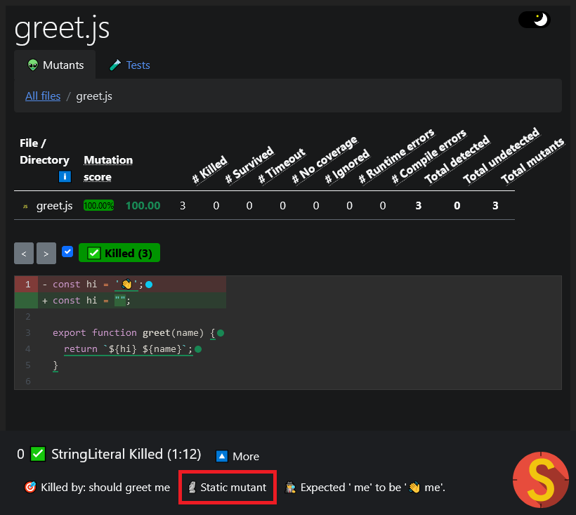

In mutation testing, not all mutants are created equal. The performance cost for some of them is higher than others. Of all mutants, _static mutants_ have the most noticeable performance impact and are sometimes not even supported. This page explains what they are and how Stryker handles them.

## What is a static mutant

A static mutant is a mutant that is executed once on startup instead of when the tests are running.

Take this small JavaScript example:

```js
// greet.js
const hi = '👋';

export function greet(name) {
  return `${hi} ${name}`;
}

// greet.spec.js
import { greet } from './greet.js';

it('should greet me', () => {
  expect(greet('me')).toBe('👋 me');
});
```

When you run StrykerJS on this code, it will create a mutant for the `hi` constant:

```diff
-const hi = '👋';
+const hi = '';
```

All Stryker frameworks use mutant schemata, or mutation switching, to activate mutations during test executing. This means that the actual code Stryker produces looks more like this:

```js
const hi = global.activeMutant === '1' ? '' : '👋';
```

The goal is that Stryker would be able to activate this mutant during test execution by setting `global.activeMutant` to `'1'`. However, since this mutant is only executed once during startup, activating or de-activating the mutant won't help. The `hi` const here is already declared, and activating mutant '1' doesn't change that.

This mutant is referred to as a _static mutant_. They are executed once and cannot be activated or de-activated later during test runtime.

You can identify static mutants in your report with the 🗿 static emoji.



You can think of similar constructs in C# with [static constructors](https://docs.microsoft.com/en-us/dotnet/csharp/programming-guide/classes-and-structs/static-constructors) or in Scala with [singleton objects](https://docs.scala-lang.org/tour/singleton-objects.html#inner-main)

## How to deal with static mutants

You can deal with static mutants in two ways:

1. You can ignore them<br />
   The mutants will be shown in your report with the "Ignored" state and won't count towards your mutation score.
2. You can run them<br />
   The static mutants will get a fresh test environment to run in. This might require a browser page refresh or the creation of a new process or app domain, which likely has a _big performance impact_. Test filtering is limited since per test coverage cannot be determined.

## Hybrid mutants

There are also static mutants that also have runtime coverage. For lack of a better word, let's call these "hybrid mutants" for now.

Let's change our example so we can make our StringMutator mutant hybrid.

```js
// greet.js
export function createGreeter() {
  const hi = '👋'; // 👽 mutated to empty string
  return (name) => `${hi} ${name}`;
}
export const greet = createGreeter();

// greet.spec.js
import { createGreeter } from './greet.js';

it('should greet me', () => {
  const greeter = createGreeter();
  expect(greeter('me')).toBe('👋 me');
});
```

We've moved the `hi` constant to a factory method `createGreeter`. This method is now executed **twice**. First _during the loading of greet.js_, and second during unit testing in the "it should greet me" test.

In JavaScript, this is a common way to deal with dependency injection where you inject the dependencies using a factory method for unit testing. But, again, similar constructs can apply to C# and Scala code.

When dealing with hybrid mutants, we can think of a third way to handle them. Namely to only run the tests that directly cover the mutant instead of pessimistically executing all tests.

## What Stryker does

Different Stryker versions use different approaches here. In the table below, you can see which choices are available per framework.

| Framework   | Support run | Support ignore | Default for static |
| ----------- | ----------- | -------------- | ------------------ |
| StrykerJS   | ✅          | ✅\*           | Run all test       |
| Stryker.NET | ✅          | ❌             | Run all test       |
| Stryker4s   | ❌          | ✅             | Ignore             |

\* Using `--ignoreStatic` (new in StrykerJS v6.0)

When you use `--ignoreStatic`, static mutants are ignored. For hybrid mutants, Stryker assumes that the mutant should be killed by the tests that cover the mutant at runtime and they are therefore handled as any other runtime mutant. Thus, in a sense, Stryker will ignore the _static part_ of hybrid mutants.
